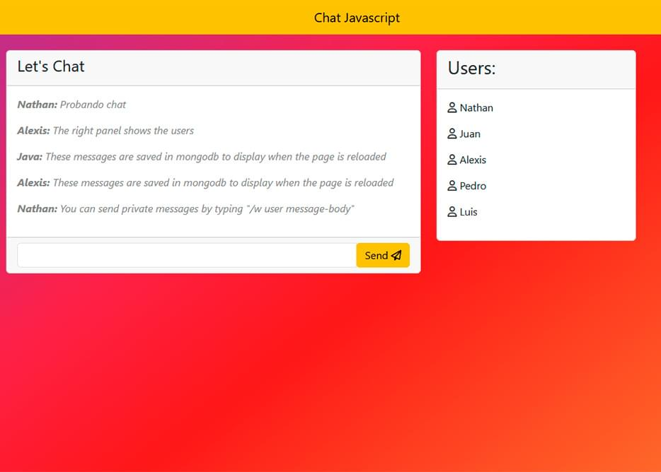

# Live Chat with JavaScript

This is an open-source real-time chat application built using JavaScript, Socket.IO, and Node.js with Express, created by **Nathan de Barros**. Users can enter a nickname, send messages, and see who else is online. It also supports private messages (whispers) and stores chat history in a MongoDB database.

This project was inspired and developed following tutorials by **Fazt** on [YouTube](https://www.youtube.com/c/FaztTech).

## Features

- Real-time communication with multiple users
- Whisper (private messaging) feature
- Online users list
- Chat history stored in MongoDB
- Alerts for username conflicts
- Simple and intuitive UI using Bootstrap

## Getting Started

### Prerequisites

- Node.js
- MongoDB (with a connection string)
- Socket.IO

### Installation

1. **Clone the repository:**

   ```
   git clone https://github.com/nathandb7/chat-javascript.git
   cd chat-javascript
2. **Install dependencies:**

Inside the project directory, run:
`npm install`

3. **Create a .env file:**

Add your MongoDB credentials to a .env file:
`DB_PASSWORD=your-mongodb-password`

3. **Start the MongoDB server (if running locally):**

`mongod`


### Running the Server

To start the server, run:
`npm start`

By default, the application will run on port 3000. You can access it in your browser at:

http://localhost:3000

If you want to change the port, modify the PORT in your .env file or directly in app.js:


`app.set('port', process.env.PORT || 3000);`


### Usage

    Open the application in your browser.
    Enter a unique nickname in the login form.
    Start chatting with others! Your messages will be broadcasted to all users.
    To send a private message, type /w username message.

### File Structure

    ```
    live-chat-js/
    │
    ├── src/                      # Source code
    │   ├── public/               # Public assets (CSS, JS, HTML)
    │   │   ├── css/              # Custom stylesheets
    │   │   ├── js/               # Client-side JavaScript (main.js)
    │   │   └── index.html        # Chat interface
    │   ├── models/               # Database models
    │   │   └── Chat.js           # Mongoose schema for chat messages
    │   ├── sockets.js            # Socket.IO event handling (server-side)
    │   └── app.js                # Express server setup
    │
    ├── .env                      # Environment variables (MongoDB credentials)
    ├── package.json              # Dependencies and scripts
    └── README.md                 # Documentation

Built With

    Node.js - JavaScript runtime
    Express - Web framework for Node.js
    Socket.IO - Real-time web socket library
    MongoDB - NoSQL database
    Bootstrap - Frontend framework for responsive design

Screenshots
Chat Interface


Username Form

Future Improvements

    Message timestamps: Add timestamps to each message for better clarity.
    Typing indicator: Show a message when a user is typing.
    Improve mobile responsiveness: Enhance the UI for mobile devices.


### License
This project is licensed under the MIT License.

### Acknowledgments
Special thanks to Fazt for the tutorials that helped in the development of this project. Check out his amazing content on YouTube.

Created by Nathan de Barros


